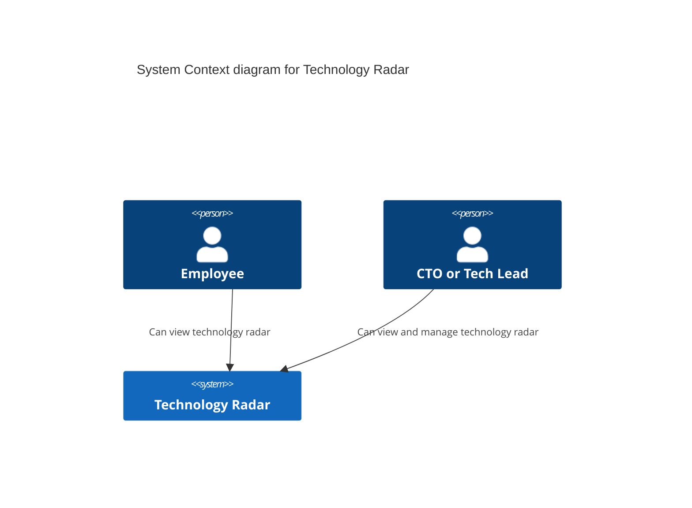
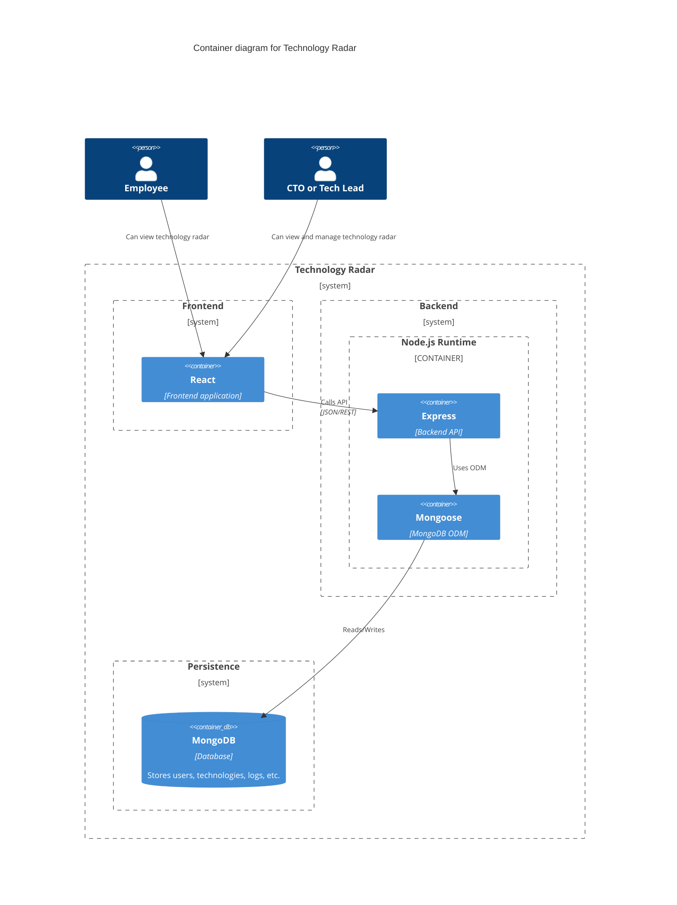
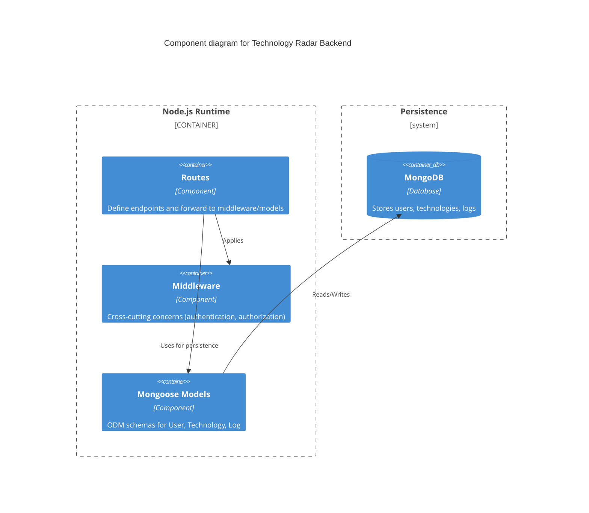
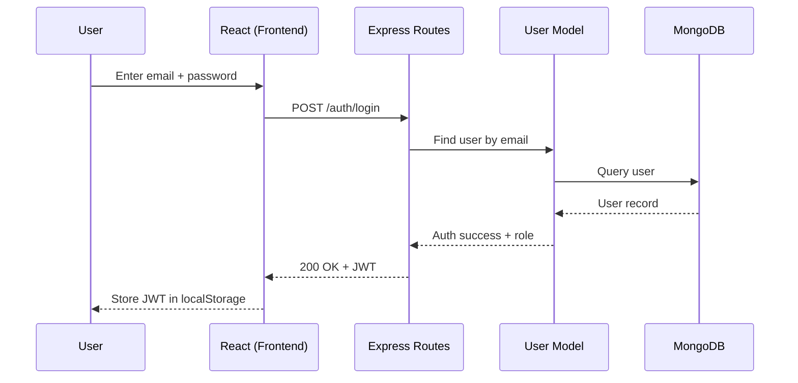
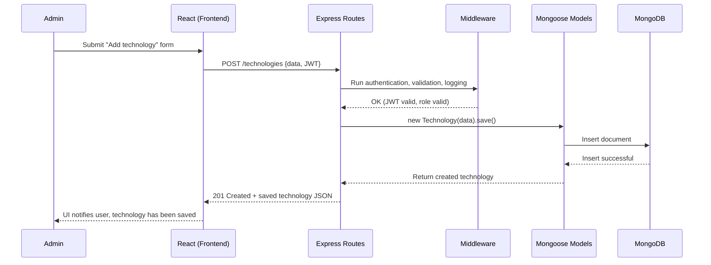
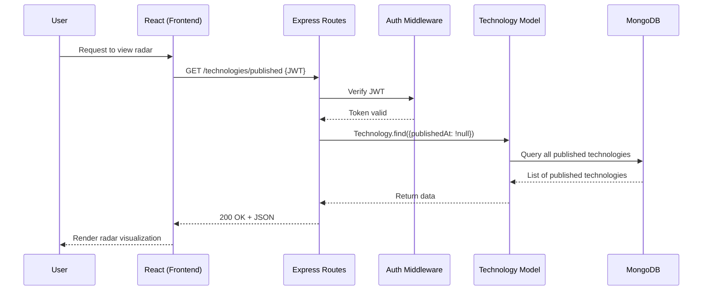
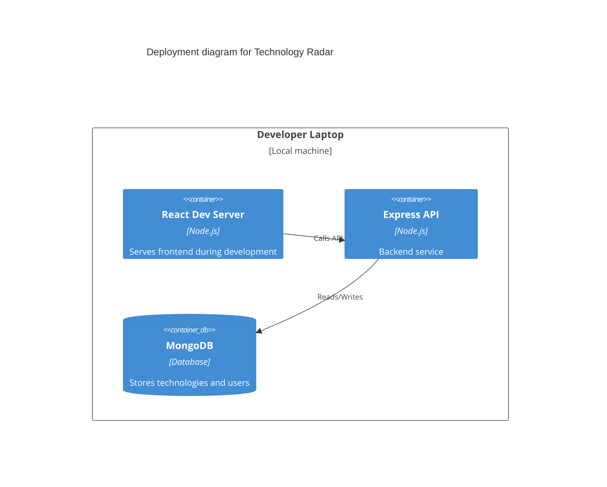
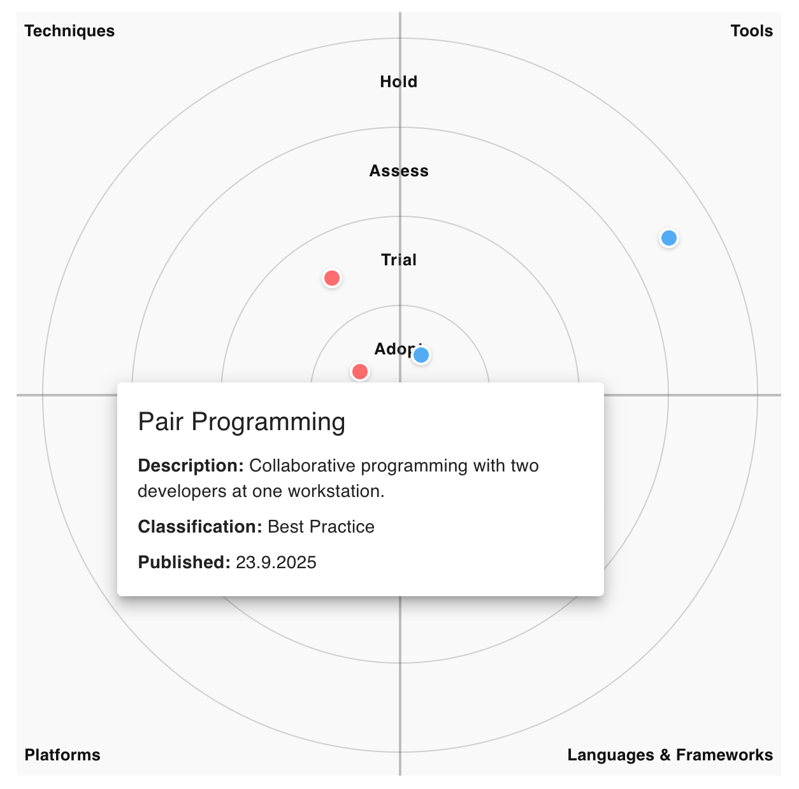

# Technology Radar architecture

This document provides the software architecture documentation of the project including decisions, diagrams and specification.

# 1. Introduction

The context and requirements for this project are provided [here](https://github.com/web-programming-lab/web-programming-lab-projekt/blob/main/Technologie-Radar.md). 

Purpose of this documentation is to provide an overview of the system for developers and stakeholders with varying degrees of technical knowledge. If any questions arise, feel free to reach out to the author: rafael.uttinger@stud.hslu.ch

# 2. Architecture constraints

## 2.1 Technical constraints
The only technical constraints were determined in the beginnings of the project as part of the assignment to choose a dedicated techstack beforehand ([ADR](./decisions/01-techstack.md)).

Additionally, some technical quality requirements were given along with the outline of this project and were taken up in the [quality chapter](./architecture.md#10-quality).

As a consequence of grading, the documented commands should be able to run on other systems.

## 2.2 Organizational constraints
Scope constraint for this project is set to ~60 hours of work, which includes implementing the project, CI/CD and documentation. Every activity is written down in a [work journal](./work-journal.md).

Once finished, the project will be turned in as a git repository.

Additionally, the work should be critically reflected including conclusion.

# 3. System context and scope

The following diagram shows the system from the business side of things.

**Employees** include anyone who could benefit from viewing the technical reasoning behind the placement of certain technologies.

A **CTO** or **Tech Lead** is anyone who is responsible for handling data within the scope of the technology radar.

# 4. Solution Strategy

| Goal/Requirements | Approach |
| ------------- | ------------- |
| Desktop/Mobile UI | Responsive design with MaterialUI |
| Fast load times | Preloading, caching, server side compression, code splitting |
| Auditability | Log admin logins in DB |
| Security | JWT, env vars, bcrypt  |
| Maintainability | modular React components, RESTful API design |
| Scalability/Availability | Limited (free-tier) MongoDB |
| Accessbility| MaterialUI components with ARIA compliance |

# 5. Building Block View
The following container diagram shows the top-level decomposition of the technology radar system.

## 5.1 Level 1

- *React*: SPA frontend, routing with React Router, responsive UI with MaterialUI
- *Node.js Runtime*: container that hosts Express + Mongoose.
- *Express*: REST API, middleware for auth/logging
- *Mongoose*: ODM mapping between schemas and MongoDB
- *MongoDB*: data store for users, technologies and logs

## 5.2 Level 2
The following diagram shows the inner workings of the technology radar express backend with its routes, middleware and usage of ODM.

- *Routes*: Defines [API endpoints](./architecture.md#82-api-endpoints). Forwards requests through middleware to Mongoose models
- *Middleware*: Express midddleware function that handle authentication and authorization using JWT tokens
- *Mongoose models*: Persistence abstraction for data integrity, schemas defined by models used by routes
- *MongoDB*: persistent data store for all domain entities, written to using Mongoose with API key handled as environment variable 

# 6. Runtime View
The following scenarios help to illustrate the inner proceedings of the system. Any mention of *handlers* allude to the express routes defined in the backend/routes folder.

## 6.1 Login
The following scenario is a user logging in using their credentials.

**Explanation:**
1. User enters credentials into login form
2. *React* sends ``POST /auth/login`` with email + password
3. Express receives the request and forward it to login handler
4. Handler calls User Model to get user by email
5. Model queries DB and receives user data
6. If credentials are valid, JWT is created and returned as response
7. React stores the JWT in local storage

## 6.2 Add new technology
A typical scenario of an admin is adding a new technology using the form provided by the UI.

**Explanation:**
1. *Admin* (already logged in) submits "Add technology" form in React, after providing the necessary data.
2. *React* sends a ``POST /technologies`` request with JSON body and JWT token.
3. *Express* receives the request and routes it to the appropriate handler.
4. *Middleware* authenticates JWT token and resolves its role to authorize the access.
5. After successful middleware pass, the handler creates a new object with the request data and calls Mongoose (``.save()``).
6. *Mongoose* saves the new document into the correct MongoDB collection
7. *MongoDB* confirms the insert
8. *Mongoose* returns the saved object to the route.
9. The *Express* handler responds with ``201 created`` and JSON of the saved object.
10. *React* notifies its user that the technology was saved.

### 6.3 Viewing published technologies
A user (employee) views the published technologies by visiting ``/viewer`` after having logged in.

**Explanation:**
1. User visits ``/viewer``.
2. *React* sends ``GET /technologies/published`` with JWT in the header
3. *Express Routes* check the JWT with *Auth Middleware*
4. If valid, the Technology Model fetches all entries from MongoDB that have published date
5. Data is returned as JSON to React
6. React renders the data visualization

# 7. Deployment View
Currently, the app runs locally on the developer laptop with React dev server, Node.js/Express backend, and MongoDB Cloud.

# 8. Concepts

<!-- TODO: domain model, cross-cutting concepts, radar visualization -->

## 8.1 Domain models

### Technology
Represents an item in the technology radar.

Attribute | Description
-- | --
*Name* | unique identifier and display name of the technology
*Category* | classifies the technology into one of the radar’s quadrants (options: `Techniques`, `Tools`, `Platforms`, `Languages & Frameworks`)
*Maturity\** | indicates adoption stage (options: `Assess`, `Trial`, `Adopt`, `Hold`)
*Description* | explains the technology and/or its usage
*Classification\** | provides an assessment of its maturity level
*Created at* | date of creation
*Published at* | date of publication; sets *maturity* and *classification* to be required
*Updated at* | date of last update

\* only required if technology is set to be published 

- Unpublished technologies must at least have a name, category, and description.
- A technology set to publish must have both `maturity` and `classification`.
- Empty strings are normalized to `null` for `maturity`, `classification`, `publishedAt` or `updatedAt`.

### User
Represents a system user who can authenticate and perform actions based on role.

Attribute | Description
-- | --
*Email* | unique login identifier
*Password* | length 8 password, hashed with salt
*Role* | determines access rights (options: `admin`, `user`)

- Every login of a user with role `admin` gets logged.

## 8.2 API endpoints

This list summarizes all endpoints, that are available to either admins or users.

| Endpoint | Method | Description | Role |
| --- | - | --------- | -- |
| ``/technologies`` | GET |list all technologies | admin |
| ``/technologies/published`` | GET | list all published technologies | admin / user
| ``/technologies`` | POST | add new technology | admin |
| ``/technologies/:id`` | PUT | edit exisiting technology | admin |
| ``/technologies/bulk`` | POST | add multiple technologies at once | admin
| ``/technologies/:id`` | DELETE | delete technology | admin 
| ``/auth/login`` | POST | login to receive JWT token (incl. role) | admin / user |
| ``/auth/register`` | POST | register new user (admin or user) | admin |

## 8.3 Radar visualization
The radar visualization presents technologies as blips within a radar diagram divided into four quadrants (category) and four rings (maturity level).

- *Quadrants* categorize the type of technology. 
- *Rings* represent the maturity or recommendation stage of a technology.
- *Blips* are positioned within a quadrant and ring, with placement calculated to distribute them evenly.
- *Colors* indicate the quadrant a blip is in, to distinguish between blips close to the edge.
- *Interactivity*: Hovering shows tooltips, and clicking a blip opens a popover with details such as description, classification, and publication date.
- *Responsiveness*: The radar adapts between 300–600px depending on screen size.

The radar is an isolated component, so that it can be used anywhere. In the future, we could even export it to other systems for others to use.

In the image above, a popover window was opened on the lower red *blip*. It is located in the innermost maturity ring (Adopt) and upper left quadrant (Techniques). Additional data can be seen in the window.

# 9. Architecture Decisions

> Template: [adr-template-minimal.md](https://raw.githubusercontent.com/adr/madr/refs/heads/develop/template/adr-template-minimal.md)

The following [Architecture Decision Records (ADR's)](https://adr.github.io/) were made:

1. [MERN Techstack](./decisions/01-techstack.md)
2. [JWT](./decisions/02-jwt.md)
3. [Logging in DB](./decisions/03-mongodb_logs.md)

# 10. Quality

## 10.1 Quality Requirements
| Quality     | Description                                         | Scenario |
| ----------- | --------------------------------------------------- | --- |
| Performance | Radar loads quickly on typical mobile connections   | SC1 |
| Security    | Only admins can modify technologies                 | SC2 |
| Reliability | System handles DB downtime gracefully	            | SC3 |
| Usability   | Radar usable on mobile without horizontal scrolling | SC4 |
| Testability | API routes covered by automated tests (≥75%)        | SC5 |

## 10.2 Quality Scenarios
| ID  | Scenario        |
| --- | --------------- |
| SC1 |	Radar view loads in <1s on 4G network. 
| SC2 |	Only admins can create/update/delete technologies (JWT-verified), using authorization middelware.
| SC3 |	If DB is unavailable, API responds with error code and stays operational.
| SC4 |	User can access radar on mobile without horizontal scrolling.
| SC5 |	Automated Jest/Supertest coverage ≥75% on backend routes.
