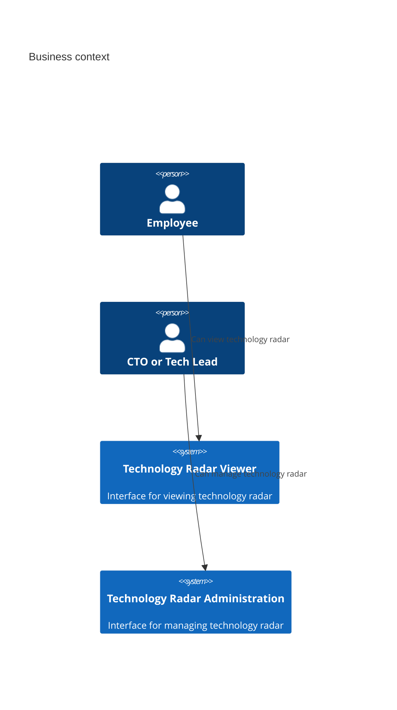

# Technology Radar architecture

This document provides the software architecture documentation of the project including decisions, diagrams and specification.

# 1. Introduction

The context and requirements for this project are provided [here](https://github.com/web-programming-lab/web-programming-lab-projekt/blob/main/Technologie-Radar.md).

# 2. Architecture constraints

Due to the limited scope of this project, no further constraints are detailed here. 

# 3. System context and scope

## 3.1 Business context

# 4. Solution Strategy

# 5. Building Block View

# 6. Runtime View

# 7. Deployment View

# 8. Concepts

# 9. Architecture Decisions

> Template: [adr-template-minimal.md](https://raw.githubusercontent.com/adr/madr/refs/heads/develop/template/adr-template-minimal.md)

The following [Architecture Decision Records (ADR's)](https://adr.github.io/) were made:

1. [MERN Techstack](./decisions/01-techstack.md)

# 10. Quality scenarios

