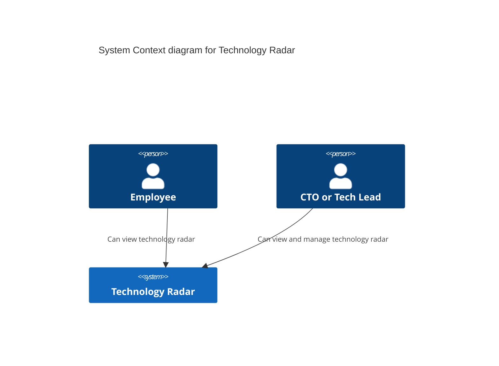
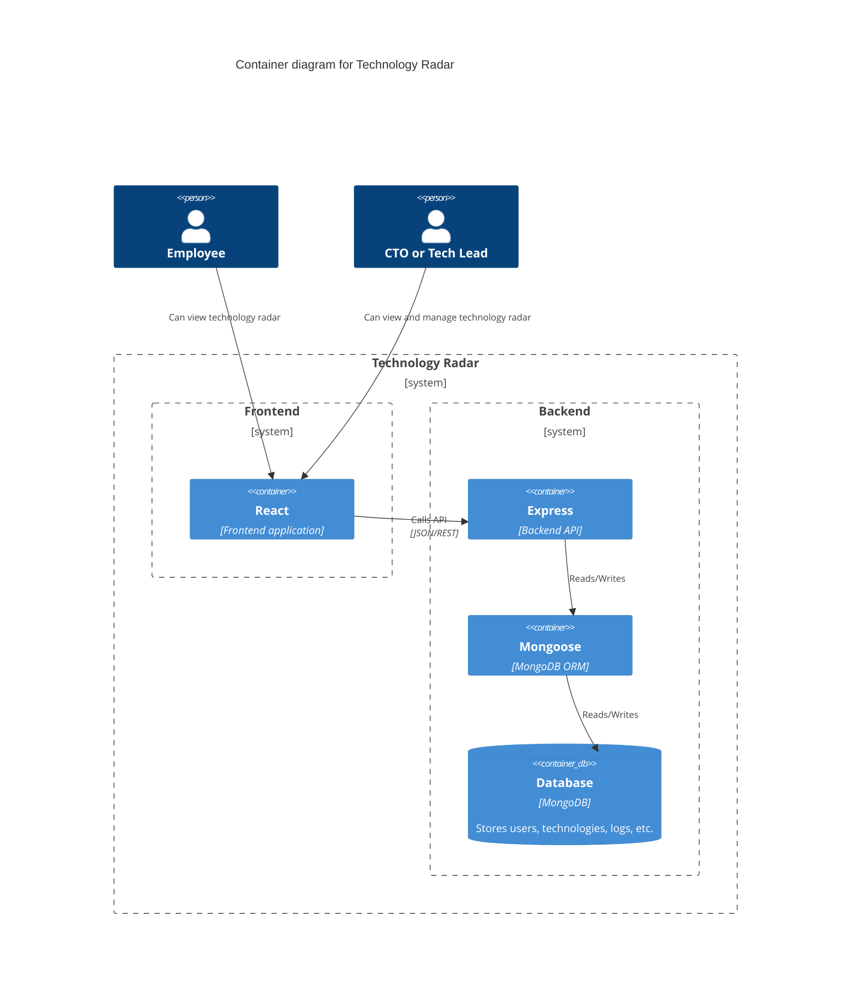
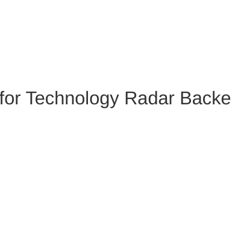

# Technology Radar architecture

This document provides the software architecture documentation of the project including decisions, diagrams and specification.

# 1. Introduction

The context and requirements for this project are provided [here](https://github.com/web-programming-lab/web-programming-lab-projekt/blob/main/Technologie-Radar.md). 

Purpose of this documentation is to provide an overview of the system for developers and stakeholders with varying degrees of technical knowledge. If any questions arise, feel free to reach out to the author: rafael.uttinger@stud.hslu.ch

# 2. Architecture constraints

## 2.1 Technical constraints
As mentioned [here](../README.md#tech-stack),  the MERN stack was chosen for this project. Reason behind this decision, was the vast amount of documentation on the usage of these combining these frameworks and having done little to no experience within those specific frameworks. 

## 2.2 Organizational constraints
Scope constraint for this project is set to ~60 hours of work, which includes implementing the project, CI/CD and documentation. Every activity is written down in a [work journal](./work-journal.md).

Once finished, the project will be turned in as a git repository.

Additionally, the work should be critically reflected including drawing a conclusion.

# 3. System context and scope

The following diagram shows the system from the business side of things.

**Employees** include anyone who could benefit from viewing the technical reasoning behind the placement of certain technologies.

A **CTO** or **Tech Lead** is anyone who is responsible for handling data within the scope of the technology radar.

# 4. Solution Strategy

| Goal/Requirements | Architectural Approach | Details |
| ------------- | ------------- | ------  |
| Viewer should be optimized for mobile/tablet view | Responsive design, using libraries built for responsiveness | |
| Viewer should be loaded within 1s, when using 4G connection |  | |
| Administration login should be recorded | Saving login by admins to DB |
| Security | JWT for authentication, environment variables in deployment  |
| Scalability* |  |
| Availability* |  |
| Maintainability | modular React components, RESTful API design |
| Accessbility| included within MaterialUI |

*limited due to DB free plan

# 5. Building Block View

## 5.1 Level 1

- *React*: SPA frontend, routing with React Router, responsive UI with MaterialUI
- *Express*: REST API, middleware for auth/logging
- *Mongoose*: ODM mapping between schemas and MongoDB
- *MongoDB*: data store for users, technologies and logs

## 5.2 Level 2

<!-- TODO: show logical components of the backend -->

# 6. Runtime View

<!-- TODO: show sequence of interactions for key use cases -->

# 7. Deployment View

<!-- TODO: document environment, infrastructure (diagram) -->

# 8. Concepts

<!-- TODO: domain model, cross-cutting concepts, radar visualization -->

## API endpoints

This list summarizes all endpoints, that are available to either admins or employees.

| Endpoint | Method | Description | Role |
| --- | - | --------- | -- |
| ``/technologies`` | GET |list all technologies | admin / employee |
| ``/technologies`` | POST | create new technology | admin |
| ``/technologies/:id`` | PUT | edit exisiting technology | admin |
| ``/auth/login`` | POST | login to receive JWT token (incl. role) | admin / employee |
| ``/auth/register`` | POST | register new user (admin or employee) | admin |

# 9. Architecture Decisions

> Template: [adr-template-minimal.md](https://raw.githubusercontent.com/adr/madr/refs/heads/develop/template/adr-template-minimal.md)

The following [Architecture Decision Records (ADR's)](https://adr.github.io/) were made:

1. [MERN Techstack](./decisions/01-techstack.md)
2. [JWT](./decisions/02-jwt.md)
3. [Logging in DB](./decisions/03-mongodb_logs.md)
4. [React](./decisions/04-react.md)
5. [Deployment](./decisions/05-deployment.md)

# 10. Quality scenarios

## 10.1 Quality Tree
| Quality | Description | Scenario |
| ------------- | ---- | ---|
| Performance | System responds to read requests within 1s on 4G mobile network | SC1 |
| Security | Only admins can create/update/delete technologies, verified via JWT token | SC2 |
| Reliability |  | SC3 |
| Usability | | SC4 |
| Testability || SC5 |

## 10.2 Quality Scenarios
| ID      | Scenario      |
| -- | ------------- |
| SC1 |  |
| SC2 | Cell 1, Row 2 |

